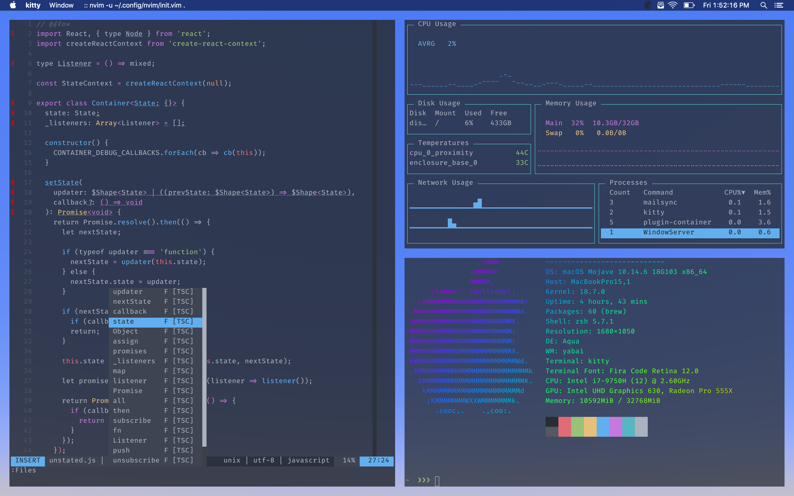

## About
👋 This repo contains scripts to bootstrap my tools of choice and take care as much of the setup process as possible.

## Getting Started
_**Pre-Requisites**_: Set up your `.ssh` keys
```
$ git clone git@github.com:adamki/dotfiles.git ~/dotfiles
$ cd ~/dotfiles
$ chmod +x install/install.sh
```

This Installation script will:
* Install technologies listed [here](#technologies-included)
* Move all old configuration files into a directory called `~/${USER}/dotfiles`
* Symlink new configuration files in `${HOME}` directory to `{USER}/dotfiles`
* Will set your default shell to Zsh

## Technologies included

| Software  |    OS      |
|-----------|------------|
| kitty     |    Both    |
| Z Shell   |    Both    |
| Ranger    |    Both    |
| htop      |    Both    |
| gotop     |    Both    |
| Neovim    |    Both    |
| vim-plug  |    Both    |
| Antigen   |    Both    |
| ripgrep   |    Both    |
| neofetch  |    Both    |
| lolcat    |    Both    |
| bundler   |    Both    |
| tpm       |    Both    |
| livedown  |    Both    |
| nvm       |    Both    |
| node      |    Both    |
| livedown  |    Both    |
| fzf       |    Both    |
| tmux      |    Both    |
| rbenv     |    Both    |
| python2   |    Both    |
| bash-language-server      |    Both    |
| vim-language-server      |    Both    |
| Fira      |    Both    |
| Fira      |    Both    |
| xcape     |    linux   |
| xclip     |    linux   |
| i3-gaps   |    linux   |
| compton   |    linux   |
| rofi      |    linux   |
| feh       |    linux   |
| firefox   |    MacOS   |
| slack     |    MacOS   |
| yabai     |    MacOS   |
| skhd      |    MacOS   |
| homebrew  |    MacOS   |
| bat       | MacOS/Arch   |
